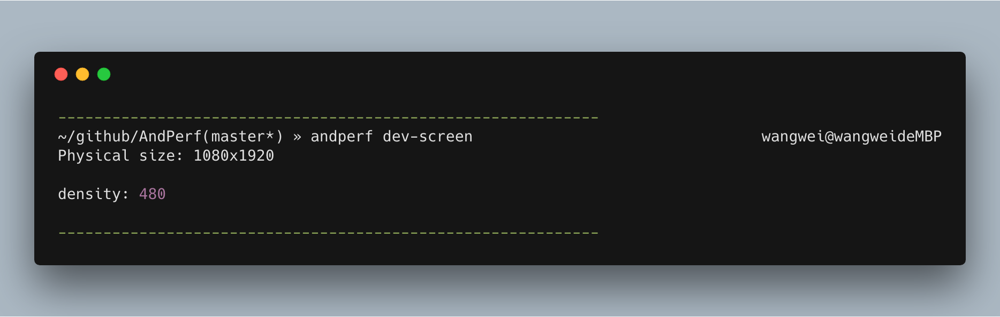
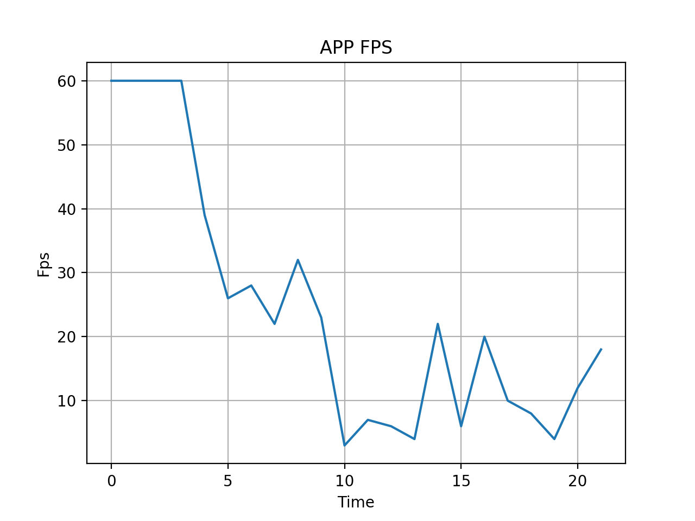
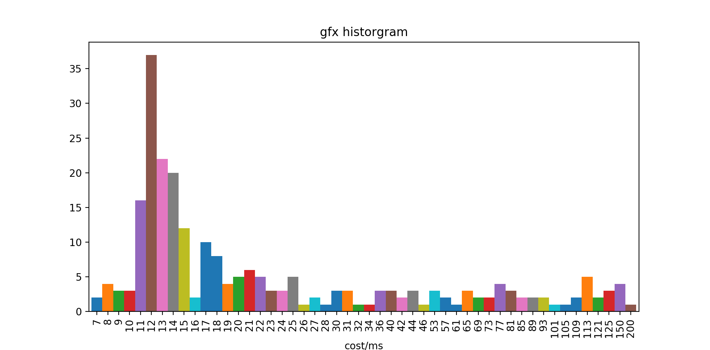
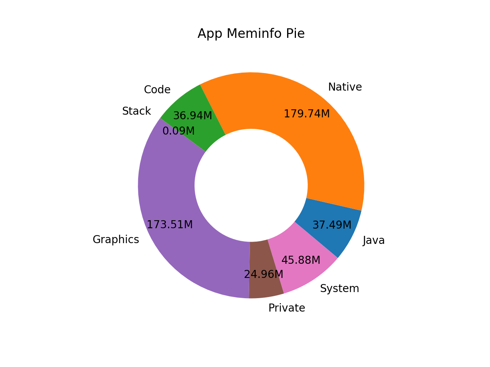
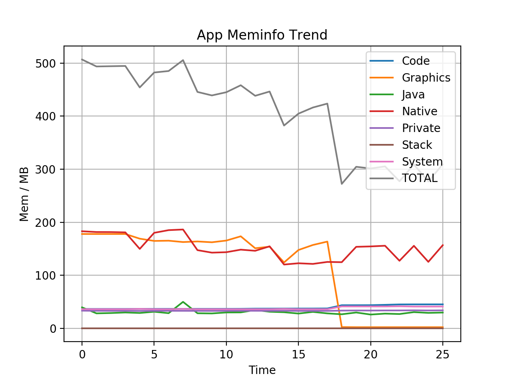
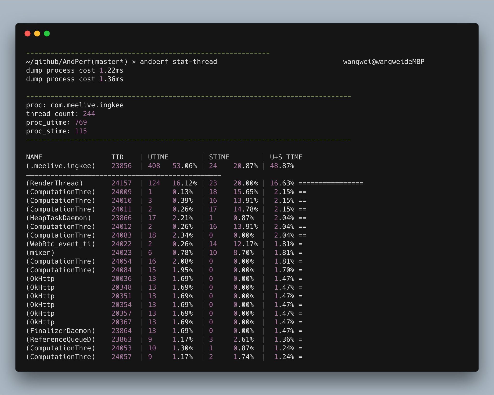
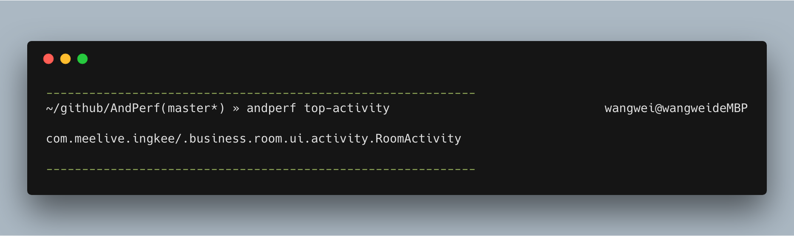

# AndPerf
Android 上的一些性能调优工具

## 安装
```bash
pip3 install andperf
```

## 运行截图









## 命令列表

```bash
andperf config  设置用户自定义配置，例如 andperf config --app={your app name} 就不用每次都要输入app package name
andperf cpuinfo 查看
andperf dev-mem 查看设备内存信息
andperf dev-screen 查看设备屏幕信息
andperf dump-config 查看当前的用户自定义配置
andperf dump-layout 导出当前栈顶Activity布局，并在浏览器打开
andperf fps 计算fps，最后会绘制一张fps变化图
andperf gfx-hist 查看gfx每帧绘制耗时分布直方图
andperf gfx-reset reset app 的gfxinfo，重新开始统计
andperf gfxinfo 查看app的gfxinfo信息
andperf meminfo 查看app的meminfo信息
andperf meminfo-pie 将当前app的各部分内存占用按照饼图展示
andperf meminfo-trend 展示app各部分内存随时间的变化
andperf screencap 截图并在浏览器打开
andperf stat-thread 统计一段时间内app进程内，各线程获得到的时间片占比
andperf systrace 调用Android systrace 命令，并在chrome中打开
andperf top-activity 查看当前栈顶Activity
andperf top-app 查看当前栈顶App
```
